```{r, include = FALSE}
knitr::opts_chunk$set(
  collapse = TRUE,
  comment = "#>"
)

options(rmarkdown.html_vignette.check_title = FALSE)
```

```{r setup}
library(dronesr)
```

### Creating dronesr

This article describes the process for creating the `dronesr` data and package. 

The `dronesr` package is created using the open access Lens database operated by the non-profit CAMBIA in Australia. The WIPO patent analytics team commonly use the Lens in patent analytics training workshops because it is easy to use, provides large scale access to data and contains important data fields, such as citations, that are not available elsewhere. 

This article explains the process through which the `dronesr` package was built focusing on the use of the Lens public interface.

We start by going to the Lens home page. If you do not have a free Lens account then sign up for one.

```{r front, echo=FALSE, fig.align='center', fig.cap="The Lens Database"}
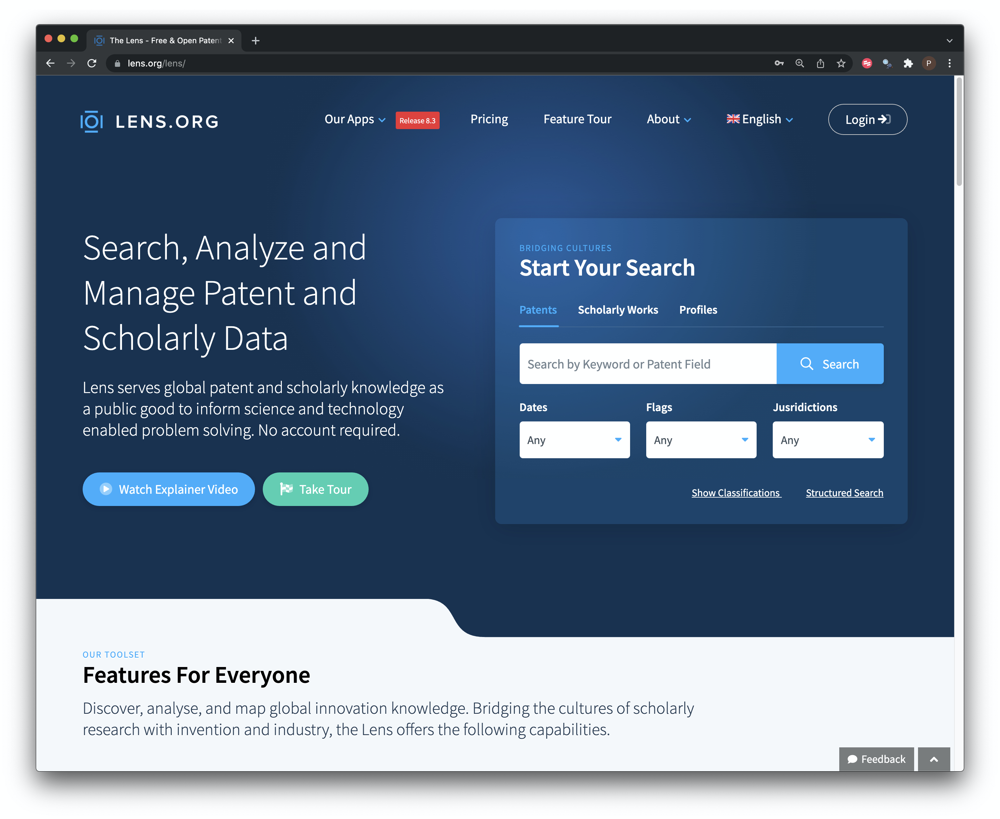
```

Choose Structured search and then enter the term drone or drones as in the figure below. Makes sure that you change the predicate from the default `AND` to `OR`. At the bottom turn `stemmed` to off. Stemmed will reduce the search term to its root meaning in this case that you will get search results for terms like droning... which we don't want. 

Note that this approach will search all text fields including the applicant names that may contain the term drones. We do this because we want to demonstrate how to clean up data later on. It is also of course pretty certain that applicant names that contain the term drone will be working on drone technology. Take some time to familiarise yourself with the different search fields such as title, abstract and claims and description searching. Those are the fields that we normally focus on in patent analytics.

```{r patentsearch, echo=FALSE, fig.align='center', fig.cap="Conduct a patent search with stemming turned off"}
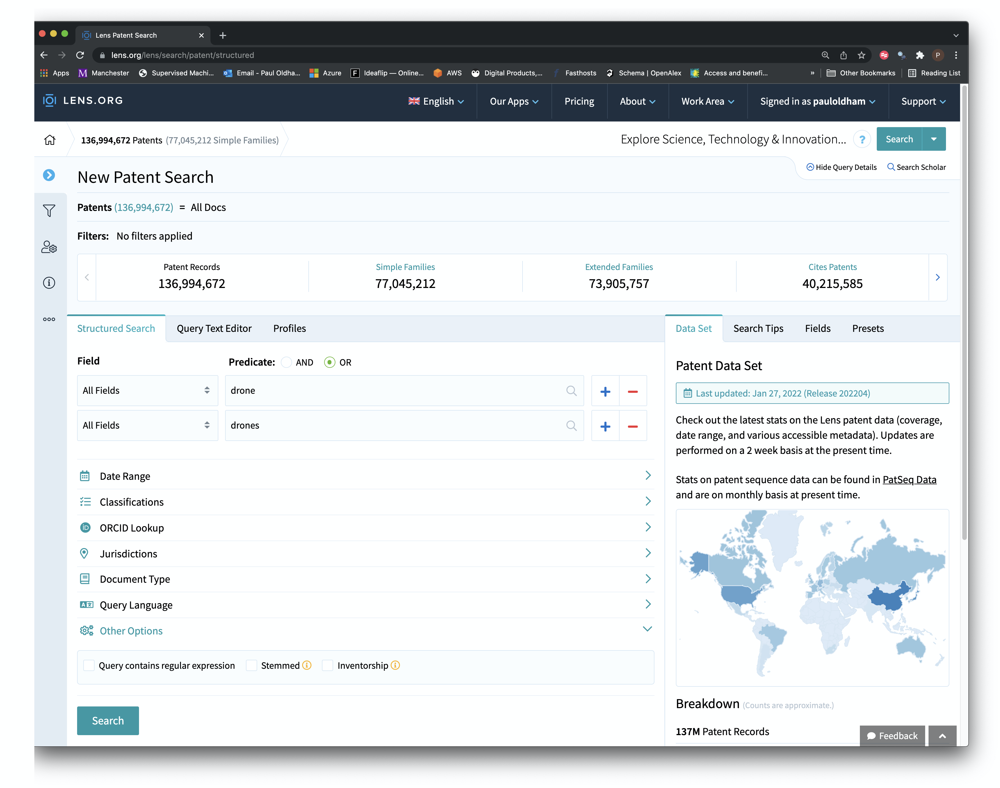
```

The result of this search is a set of 101,584 patent documents (applications, grants, search reports and so on). These documents will include many republications of the same document (as applications, as grants, with search reports and so on). We therefore want to remove the duplication to focus in as far as possible on the original filings. 

For our purposes we will choose the Simple families. Click on simple families.

```{r families, echo=FALSE, fig.align='center', fig.cap="Reduce the dataset to Simple Families"}
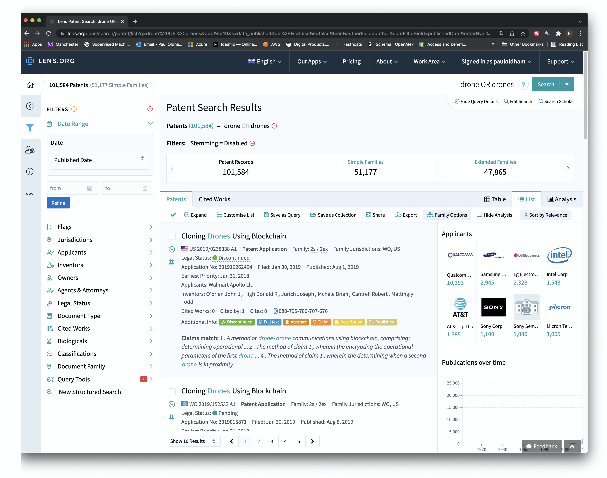
```

We can export up to 50,000 records from the Lens, which is great, but we have 51,177 records. To address this we will use the Date Range filter to limit the data by publication year to between the start of 1990 and the end of 2021 as in the image below. 

```{r date, echo=FALSE, fig.align='center', fig.cap="Restrict the data to 1990 to 2021"}
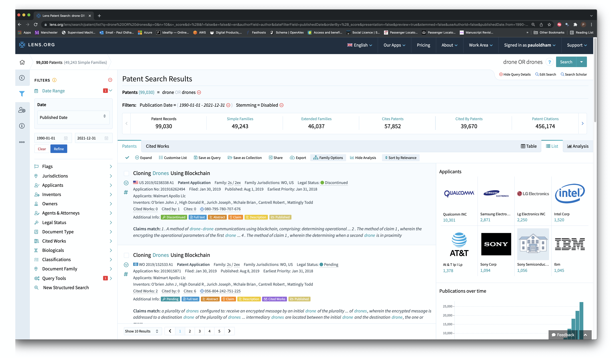
```

This brings the data to 49,243 records. We can create collection of these records by Clicking on the tick mark under Patents and next to Expand and choosing `All Results`. When we have selected all of the results we will see a `Create Collection` icon. If we click on that we can create a collection. Here we create a public collection that anyone can access. You can access that collection at the link below. This shareable link is created by choosing Access when the collection has been created as in the image below.

[https://www.lens.org/lens/search/patent/list?collectionId=199031](https://www.lens.org/lens/search/patent/list?collectionId=199031)

```{r collection, echo=FALSE, fig.align='center', fig.cap="Create a Collection"}
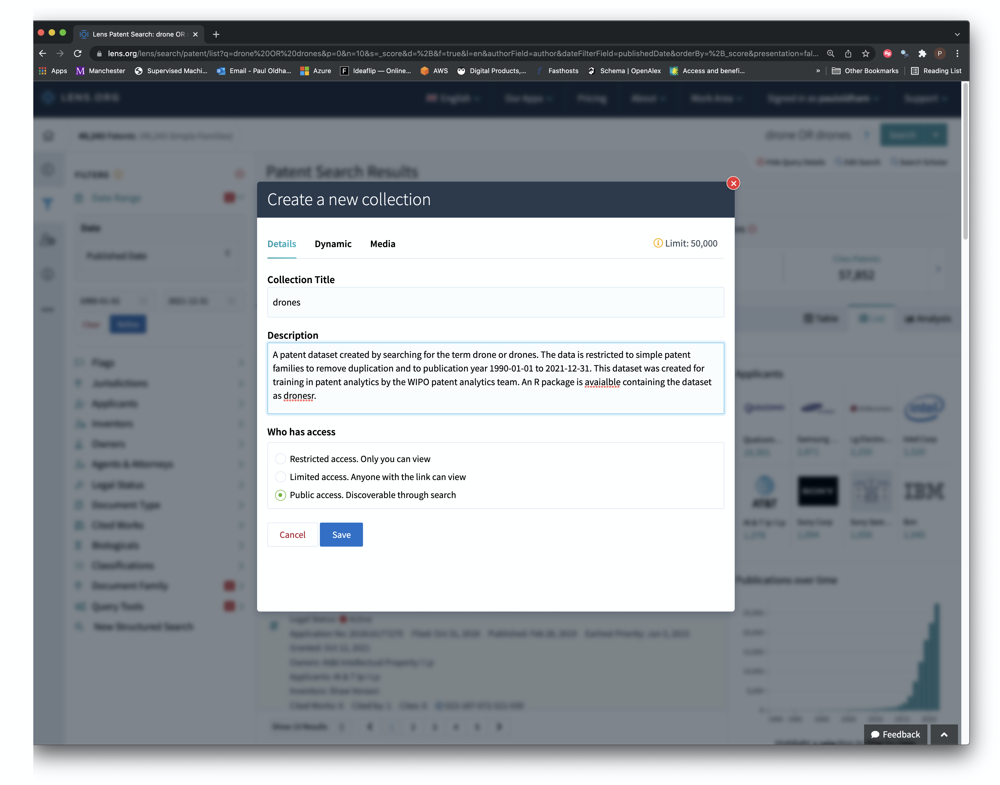
```

When the collection has been created we are in a position to download all of the records. Look for the `Export` button on the results page. You will then see the pop up box in the image below. Choose 50,000 records and optionally give the file a name. You will want to export in .csv format (the default).

```{r export, echo=FALSE, fig.align='center', fig.cap="Set up an Export"}
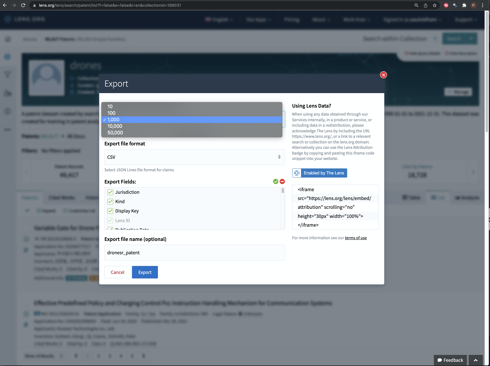
```

For larger results sets such as this the Lens will email the dataset link to you. If you do not create an account you will only be able to export a smaller amount. 

## Additional Data

The lens is a rich source of additional data that is not available in other databases.

### Literature Cited by Patents

To obtain the cited literature choose the `Cited Works` tab next to `Patents`. This reveals that there are 18,747 cited articles in the patent data. Choose the `export` button and change the number of records to 50,000, give the file a name and export it. This becomes `drones_pat_citedlit` in the raw folder in `dronesr`.

```{r citedlit, echo=FALSE, fig.align='center', fig.cap="Export the Cited Literature in Cited Works"}
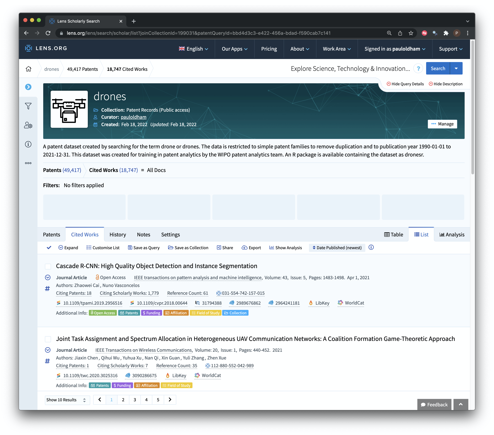
```

## Patent Citations

We can obtain the Patents Cited by our core dataset by choosing the `Cites Patents` tab in the results. For ease of reference we will use the export button and save then as cited patents as in the image below.

```{r citedpat, echo=FALSE, fig.align='center', fig.cap="Export the Cited Literature in Cited Works"}
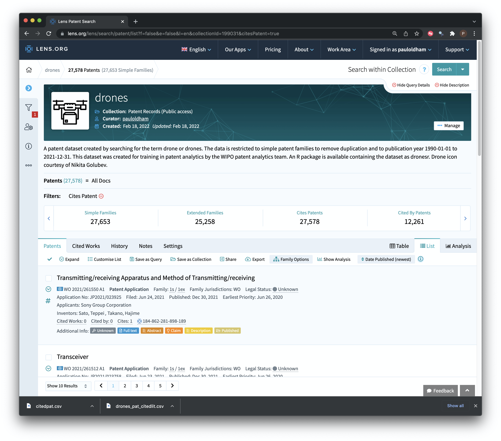
```

We then want to move over to the `Cited by Patents` and we download the results using the Export button and call them `citingpat.csv`.

```{r citingpat, echo=FALSE, fig.align='center', fig.cap="Export the Cited Literature in Cited Works"}
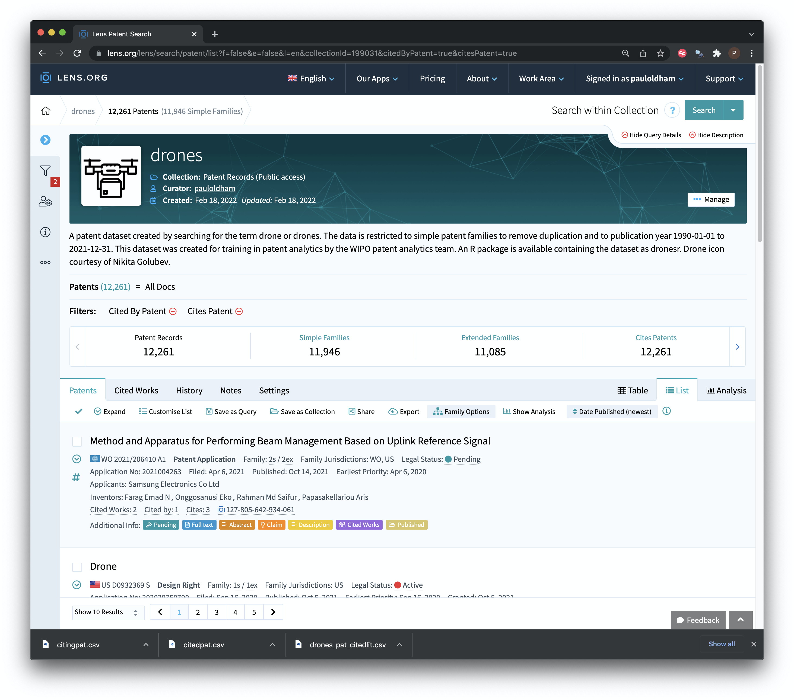
```

### Scientific Literature

We will normally want to obtain the scientific literature on a topic of interest to inform patent analysis. 

We turn to the lens scholarly interface to search the literature as in the image below. As with the patent data we will search all fields. But take the time to check out the options that can be used here. 

```{r litsearch, echo=FALSE, fig.align='center', fig.cap="Use Lens Scholarly to Search for Literature"}
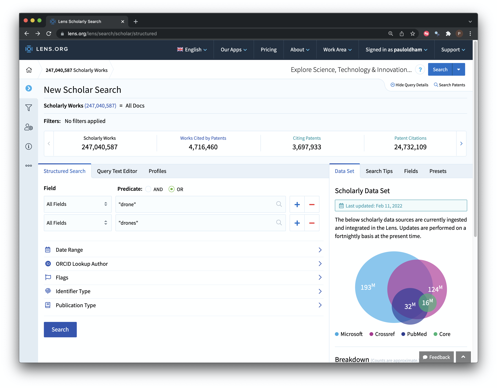
```

```{r lit, echo=FALSE, fig.align='center', fig.cap="Use Lens Scholarly to Search for Literature"}
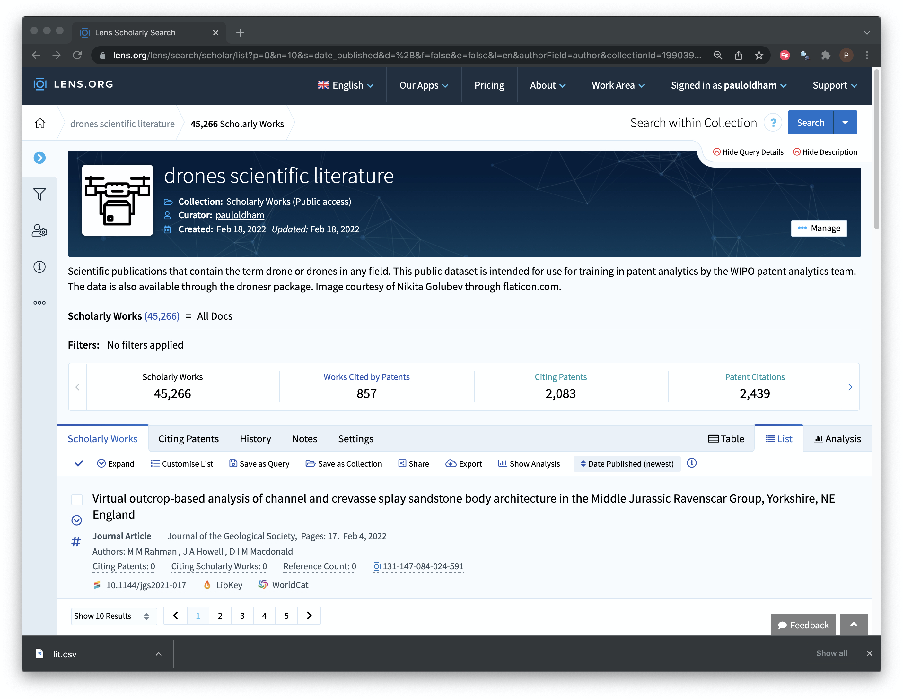
```

This gives us 45,256 results as we see above. We then use export to download the file to lit stored in the data/raw folder. 

The literature collection is publicly accessible at [https://www.lens.org/lens/search/scholar/list?collectionId=199039](https://www.lens.org/lens/search/scholar/list?collectionId=199039).
